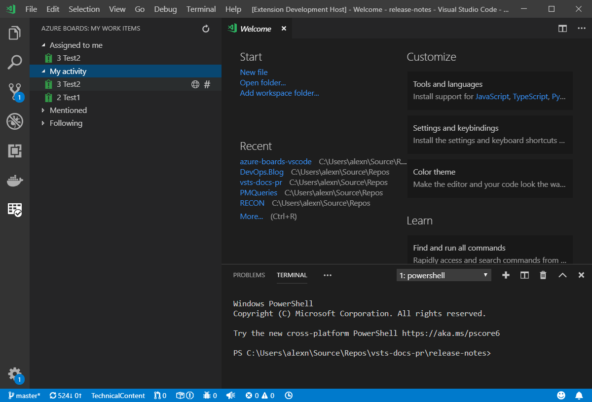

# Azure Boards Extension for Visual Studio Code

This extension provides easy access to your Azure Boards work items, directly from within Visual Studio Code. See the work assigned to you, work you've recently had activity on, work you've been mentioned on, and work you're following. You can open a work item to gather more context or make an edit. Once you're ready to commit, starting a commit message that includes a work item mention is just a click away.

## Prerequisites

### Azure DevOps Services

If you are using the extension with Azure DevOps Services, ensure you have an Azure DevOps Services organization. If you do
not have one, [sign up for Azure DevOps Services](https://aka.ms/SignupAzureDevOps/?campaign=azure~boards~vscode~readme).

### Azure DevOps Server / Team Foundation Server

Azure DevOps Server and Team Foundation Server are not yet supported.

## Installation

First, you will need to install [Visual Studio Code](https://code.visualstudio.com/download) `1.30.0` or later.

To install the extension with the latest version of Visual Studio Code (version 1.30.0 is the latest as of this writing), bring up the Visual Studio Code Command Palette (`F1`), type `install` and choose `Extensions: Install Extensions`. In the `Search Extensions in Marketplace` text box, type `azure boards`. Find the `Azure Boards` extension published by _Microsoft_ and click the `Install` button. Restart Visual Studio Code.

## Mentioning work items in a commit message

Clicking the mention icon on a work item within the extension automatically switches over to Source Control and adds the work item ID mention to the commit message. 

- Azure Repos: #[work item id]
- GitHub.com: AB#[work item id]

Note: GitHub Enterprise Server support for prefixing with AB# is on the backlog.

## Support

Support for this extension is provided on our [GitHub Issue Tracker](https://github.com/microsoft/azure-boards-vscode/issues). You
can submit a [bug report](https://github.com/microsoft/azure-boards-vscode/issues/new), a [feature request](https://github.com/microsoft/azure-boards-vscode/issues/new)
or participate in [discussions](https://github.com/microsoft/azure-boards-vscode/issues).

## Contributing to the Extension

See the [developer documentation](CONTRIBUTING.md) for details on how to contribute to this extension.

## Code of Conduct

This project has adopted the [Microsoft Open Source Code of Conduct](https://opensource.microsoft.com/codeofconduct/). For more information see the [Code of Conduct FAQ](https://opensource.microsoft.com/codeofconduct/faq/) or contact [opencode@microsoft.com](mailto:opencode@microsoft.com) with any additional questions or comments.

## Privacy Statement

The [Microsoft Privacy Statement](http://go.microsoft.com/fwlink/?LinkId=528096&clcid=0x409)
describes the privacy statement of this software.

## License

This extension is [licensed under the MIT License](LICENSE). Please see the [third-party notices](ThirdPartyNotices.txt)
file for additional copyright notices and license terms applicable to portions of the software.
